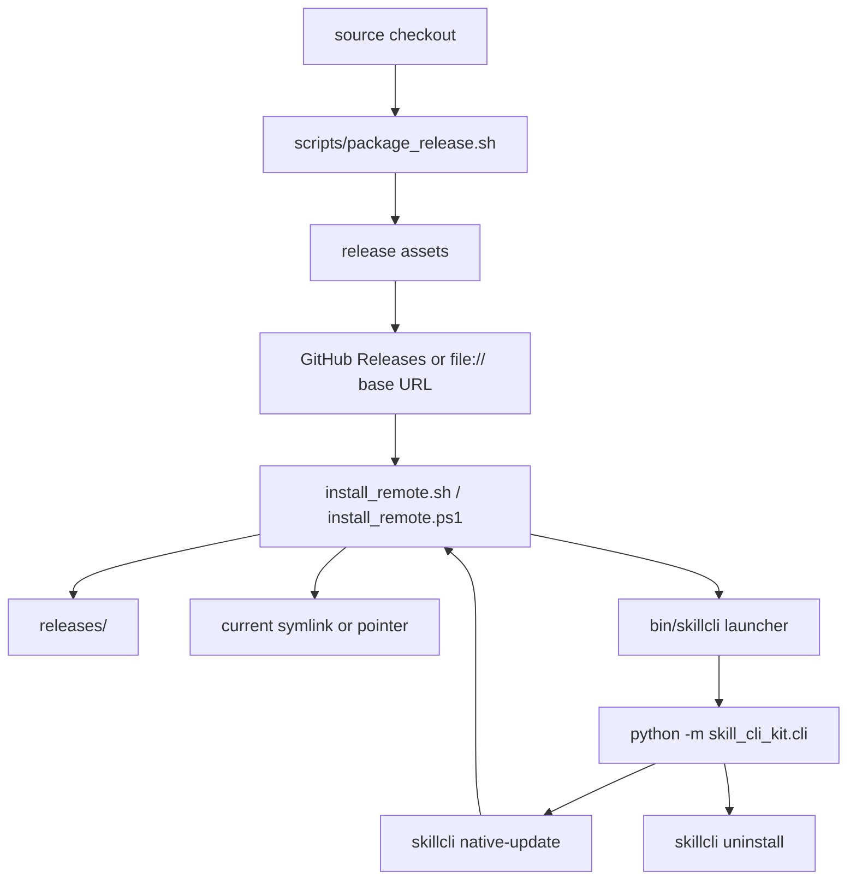

# ARCHITECTURE - Native Installer Distribution

> 本文件只记录本次需求引入或改变的结构、数据流、配置和边界。

## 1. Scope

本需求在现有 source checkout lifecycle 之外增加 native release lifecycle。两者并行存在：

- Source checkout lifecycle: 本地开发、`scripts/update_cli.sh`、`skillcli update <project>`、`sync-skill`。
- Native release lifecycle: `scripts/package_release.sh`、GitHub Releases assets、`install_remote`、`skillcli native-update`、`skillcli uninstall`。

## 2. Native Release Assets

`scripts/package_release.sh` 产出一个 release asset directory：

| Asset | 作用 |
|---|---|
| `skillcli-<version>.tar.gz` | 包含 README、AGENTS、pyproject、`src/`、`skill/`、`scripts/`、`docs/` 的发布包 |
| `skillcli-<version>.tar.gz.sha256` | installer 下载后校验的 checksum |
| `manifest.json` | installer 读取的版本、artifact、checksum、entrypoint metadata |
| `install_remote.sh` | Unix installer |
| `install_remote.ps1` | Windows installer |

发布包保留 `docs/_generated/skillcli/` 目录，但不打包已生成报告内容。

## 3. Install Layout

默认 native install layout：

```text
~/.local/share/skillcli/
  current -> releases/<version>
  releases/
    <version>/
      src/
      skill/
      scripts/
      docs/
~/.local/bin/
  skillcli
```

可通过环境变量覆盖：

| Env | 默认值 | 用途 |
|---|---|---|
| `SKILLCLI_INSTALL_ROOT` | `$HOME/.local/share/skillcli` | release root |
| `SKILLCLI_BIN_DIR` | `$HOME/.local/bin` | launcher 目录 |
| `SKILLCLI_RELEASE_BASE_URL` | GitHub latest release downloads URL | installer asset 来源 |

## 4. Data Flow



## 5. Command Boundaries

| Command | Lifecycle | Boundary |
|---|---|---|
| `skillcli update <project>` | Source checkout | 更新某个源码目录内的 CLI 和 skill wrapper |
| `skillcli native-update` | Native release | 重新运行 release installer 并切换 native `current` |
| `skillcli uninstall` | Native release | 删除 owned launcher、release root 和可选 installed skill wrapper |

## 6. Safety Rules

- Installer 必须在 checksum 校验通过后才切换 `current`。
- `uninstall` 必须默认显示 plan，只有 `--yes` 才真正删除。
- `uninstall` 不删除危险路径：根目录、home、bin 父目录、空路径、相对路径或不属于 `skill-cli-kit` 的 launcher。
- Native installer 默认同步 Codex 和 Agents skill wrapper；用户可传 `--no-sync-skill` 跳过。

## 7. Known Follow-ups

- 把经过验证的 native release layer 下沉到 `skillcli init` 生成模板。
- 在 Windows 环境执行 `install_remote.ps1` live smoke。
- 发布后执行公网 GitHub release install smoke。
